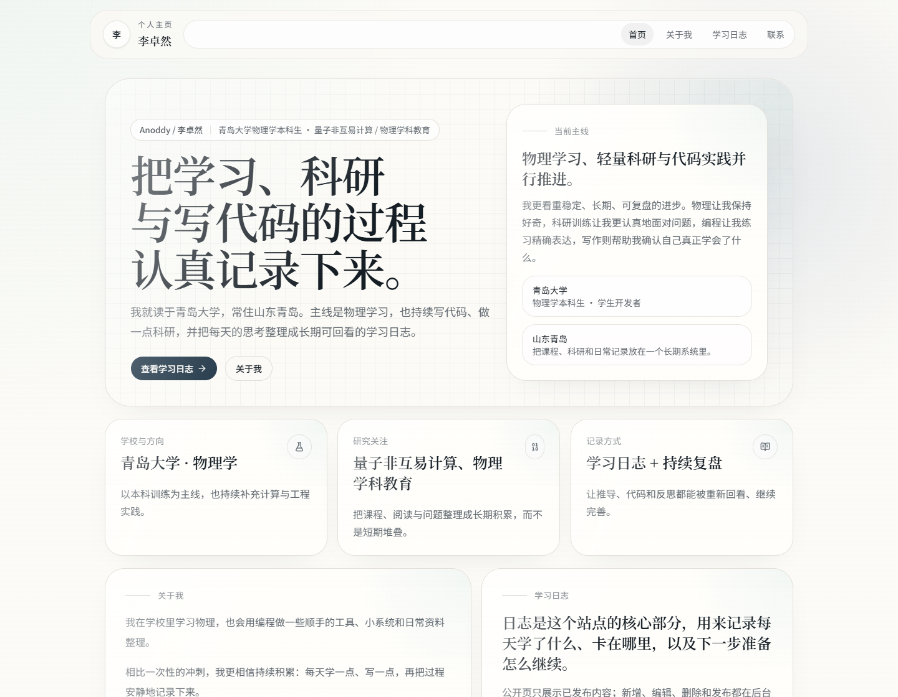
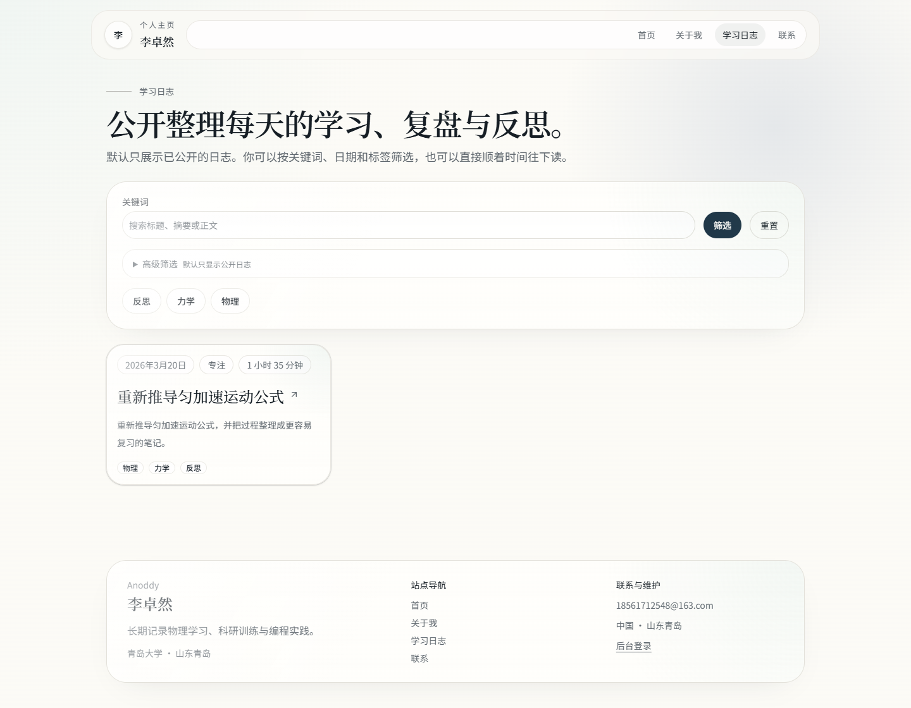
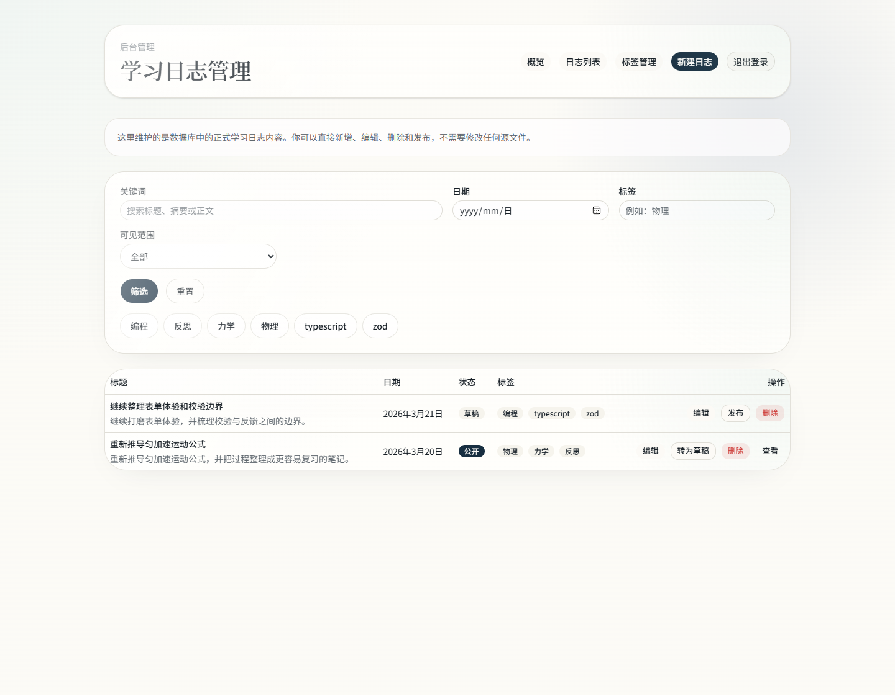
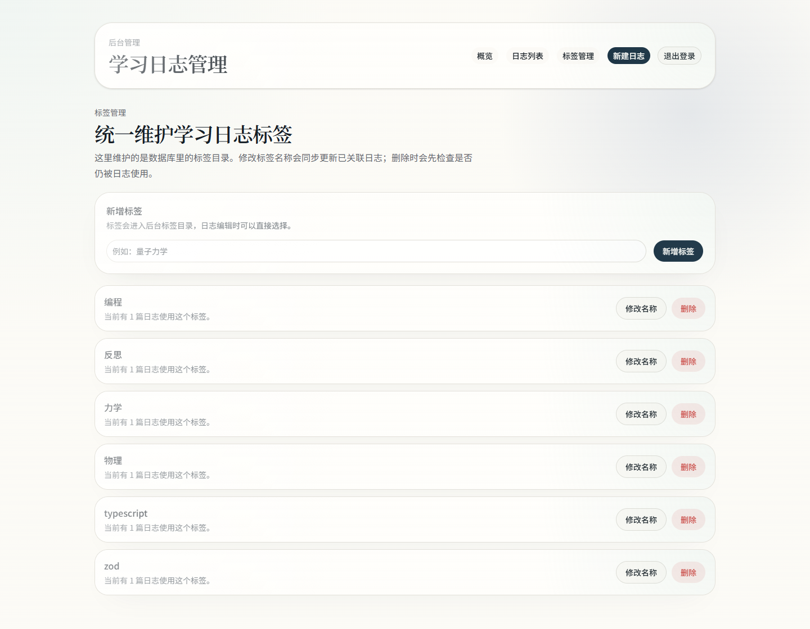
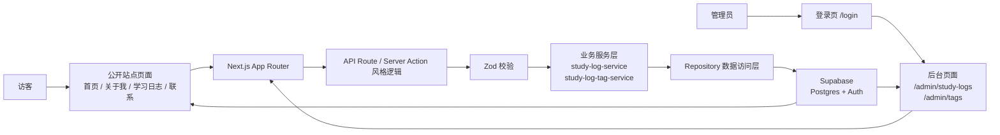
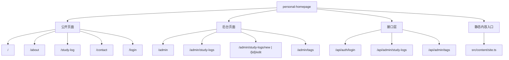
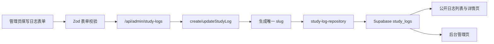
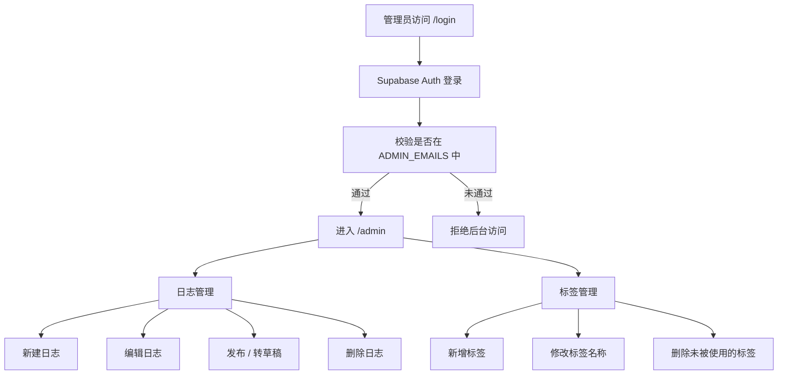

# personal-homepage

> 一个面向长期学习记录的中文个人主页项目。它把个人展示、公开学习日志、管理员后台、标签管理与真实数据库写入整合在同一套 Next.js 应用中，既适合作为线上站点，也适合作为可复现的全栈课程/作品项目。

<p>
  
  
  
  
  
</p>

**在线访问**

- 主站：[https://www.anoddy.com](https://www.anoddy.com)
- 学习日志：[https://www.anoddy.com/study-log](https://www.anoddy.com/study-log)
- 项目介绍文档：[docs/project-introduction.md](docs/project-introduction.md)
- 内容维护指南：[CONTENT_GUIDE.md](CONTENT_GUIDE.md)

<p align="center">
  
</p>

## 项目定位

`personal-homepage` 不是单纯的静态展示页，也不是把 Markdown 文件堆进仓库的“伪后台”站点。  
它的核心目标是构建一个**可正式上线、可长期维护、可持续记录学习过程**的中文个人主页系统：

- 前台负责展示个人信息、学习轨迹与公开日志
- 后台负责管理学习日志与标签，不依赖手改源文件
- 数据通过 Supabase 落库，公开/草稿边界清晰
- GitHub 与 Vercel 负责持续交付，自定义域名可直接对外访问

这个项目特别适合以下场景：

- 作为个人品牌站与长期学习档案
- 作为全栈课程项目或毕业设计阶段性成果
- 作为 Next.js + Supabase 的真实项目模板参考

<details>
<summary>目录</summary>

- [核心特性](#核心特性)
- [界面展示](#界面展示)
- [项目架构](#项目架构)
- [技术选型与设计决策](#技术选型与设计决策)
- [快速开始](#快速开始)
- [内容维护说明](#内容维护说明)
- [测试与质量保证](#测试与质量保证)
- [项目亮点与设计原则](#项目亮点与设计原则)
- [未来可扩展方向](#未来可扩展方向)
- [许可证与致谢](#许可证与致谢)

</details>

---

## 核心特性

### 1. 面向长期表达的中文个人主页

- 首页、关于我、联系页采用统一的中文信息结构
- 风格克制、留白充足，适合长期维护而非一次性展示
- 静态内容集中在 `src/content/site.ts`，后续修改成本低

### 2. 真实后端驱动的学习日志系统

- 支持日志创建、编辑、删除、发布/转草稿
- 支持按关键词、日期、标签筛选
- 正文采用 Markdown，公开页按正式排版展示
- 数据持久化到 Supabase Postgres，而非本地文件

### 3. 管理员后台直连数据库

- 管理员通过 `/login` 登录后进入 `/admin`
- 可直接维护学习日志与标签目录
- 标签支持新增、改名、删除，并与日志编辑联动
- 删除仍被使用的标签会被阻止，避免数据污染

### 4. 完整的工程化交付链路

- TypeScript 严格模式
- 表单前后端双重校验，核心逻辑基于 Zod
- GitHub `main` 分支与 Vercel 生产部署联动
- 已完成自定义域名接入：`www.anoddy.com`

---

## 界面展示

<table>
  <tr>
    <td width="50%">
      
      <p><strong>首页</strong><br/>聚合个人定位、研究兴趣与学习日志入口。</p>
    </td>
    <td width="50%">
      
      <p><strong>学习日志公开页</strong><br/>面向访客展示已发布日志，支持筛选与检索。</p>
    </td>
  </tr>
  <tr>
    <td width="50%">
      
      <p><strong>后台日志管理</strong><br/>直接对数据库中的日志内容做增删改查与发布控制。</p>
    </td>
    <td width="50%">
      
      <p><strong>后台标签管理</strong><br/>统一维护标签目录，并检查日志引用关系。</p>
    </td>
  </tr>
</table>

---

## 项目架构

### 系统架构图



### 页面与模块结构图



### 学习日志数据流转图



### 管理员后台操作流程



---

## 技术选型与设计决策

| 技术/方案 | 在项目中的角色 | 选择原因 |
| --- | --- | --- |
| Next.js App Router | 页面、路由、服务端渲染、API 路由 | 统一前后端边界，天然适合个人站点 + 管理后台的一体化交付 |
| TypeScript | 类型约束与接口协作 | 降低页面、服务层、仓储层之间的联调成本 |
| Tailwind CSS + shadcn/ui | UI 结构与基础组件 | 保持开发效率，同时保留足够的设计可塑性 |
| Supabase Postgres | 学习日志持久化 | 轻量、稳妥、适合个人项目快速落地真实数据库能力 |
| Supabase Auth | 管理员登录 | 省去自建认证基础设施，快速建立权限边界 |
| Zod | 表单与筛选参数校验 | 前后端共用校验语义，错误反馈更明确 |
| Repository + Service 分层 | 数据访问与业务逻辑解耦 | 便于测试、扩展和后续替换数据源 |
| Vitest + Testing Library | 单元/交互测试 | 覆盖日志 CRUD、标签管理、可见性边界和交互细节 |

这套技术决策的核心不是“堆栈新”，而是让项目同时满足三件事：

1. 可以正式上线
2. 可以长期维护
3. 可以作为真实全栈项目被他人复现

---

## 快速开始

### 1. 安装依赖

```bash
pnpm install
```

### 2. 配置环境变量

复制 `.env.example` 为 `.env.local`：

```bash
NEXT_PUBLIC_SITE_URL=http://localhost:3000
NEXT_PUBLIC_SUPABASE_URL=你的 Supabase 项目地址
NEXT_PUBLIC_SUPABASE_ANON_KEY=你的 Supabase anon key
SUPABASE_SERVICE_ROLE_KEY=你的 Supabase service role key
ADMIN_EMAILS=管理员邮箱，多个用英文逗号分隔
```

### 3. 初始化数据库

在 Supabase SQL Editor 执行：

- [supabase/migrations/202603220001_create_study_logs.sql](supabase/migrations/202603220001_create_study_logs.sql)

如需写入演示数据：

```bash
pnpm seed
```

### 4. 启动开发环境

```bash
pnpm dev
```

### 5. 常用检查命令

```bash
pnpm lint
pnpm typecheck
pnpm test
pnpm build
```

### 6. 管理员登录

- 登录入口：`/login`
- 后台首页：`/admin`
- 日志管理：`/admin/study-logs`
- 标签管理：`/admin/tags`

注意：

- 只有出现在 `ADMIN_EMAILS` 中、且已存在于 Supabase Auth 的账号才有后台权限
- 学习日志与标签均通过后台维护，不需要手改源文件

---

## 内容维护说明

### 静态内容

个人资料、首页文案、关于我、联系信息等静态内容集中维护在：

- [src/content/site.ts](src/content/site.ts)

### 数据库内容

以下内容通过后台维护：

- 学习日志
- 标签目录
- 发布 / 草稿状态

更详细的修改说明请看：

- [CONTENT_GUIDE.md](CONTENT_GUIDE.md)

---

## 测试与质量保证

项目当前采用以下质量门槛：

- `pnpm lint`：静态检查
- `pnpm typecheck`：类型检查
- `pnpm test`：Vitest 自动化测试
- `pnpm build`：生产构建验收

自动化测试覆盖重点包括：

- 学习日志创建、编辑、删除
- 草稿/公开可见性边界
- 非管理员后台访问拦截
- 标签新增、改名、删除约束
- 标签筛选链接状态
- 顶部栏与回到顶部按钮的交互逻辑

如果你想了解更正式的系统说明、架构图、数据库设计与测试表格，可直接阅读：

- [docs/project-introduction.md](docs/project-introduction.md)

---

## 项目亮点与设计原则

### 中文表达优先

整个站点围绕中文个人主页场景设计，不依赖英文模板文案拼装。

### 后台化的学习记录

日志与标签都走后台，不需要维护者理解代码结构后再去改数据文件。

### 轻量但真实

项目不追求复杂基础设施，却完整实现了认证、数据库、权限、发布状态与自动部署。

### 展示与复现并重

仓库既能作为项目主页浏览，也保留了快速启动、环境变量、迁移与测试文档。

---

## 未来可扩展方向

在不破坏当前简洁定位的前提下，项目后续可以继续扩展：

- 基于 PostgreSQL 或外部搜索服务的全文检索
- RSS / Atom 订阅输出
- 学习日志统计面板与年度归档页
- 研究记录、阅读笔记、课程归档等更细分的内容模块
- 评论、点赞、订阅等更强的互动功能

这些方向目前尚未实现，本仓库也没有伪造相关能力。

---

## 许可证与致谢

### 许可证

当前仓库未单独附带 `LICENSE` 文件。若你需要在课程、展示或二次发布中使用本项目，请先根据实际用途补充许可证或联系作者确认使用方式。

### 致谢

项目实现得益于以下生态：

- [Next.js](https://nextjs.org/)
- [Supabase](https://supabase.com/)
- [Vercel](https://vercel.com/)
- [Tailwind CSS](https://tailwindcss.com/)
- [shadcn/ui](https://ui.shadcn.com/)
- [Zod](https://zod.dev/)

---

如果你希望从“项目展示”视角继续阅读，请看 [docs/project-introduction.md](docs/project-introduction.md)。  
如果你希望从“后续自己怎么维护”视角继续阅读，请看 [CONTENT_GUIDE.md](CONTENT_GUIDE.md)。
