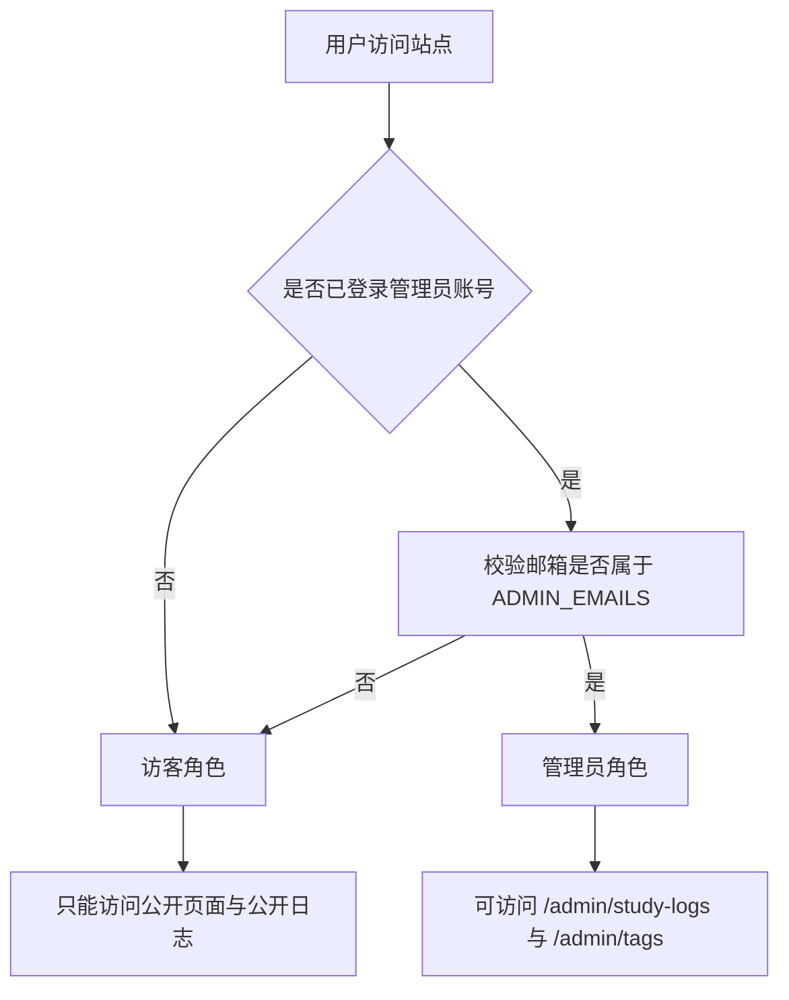
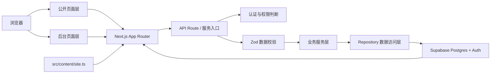
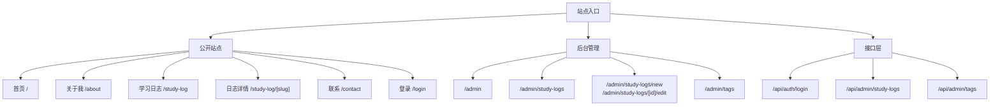
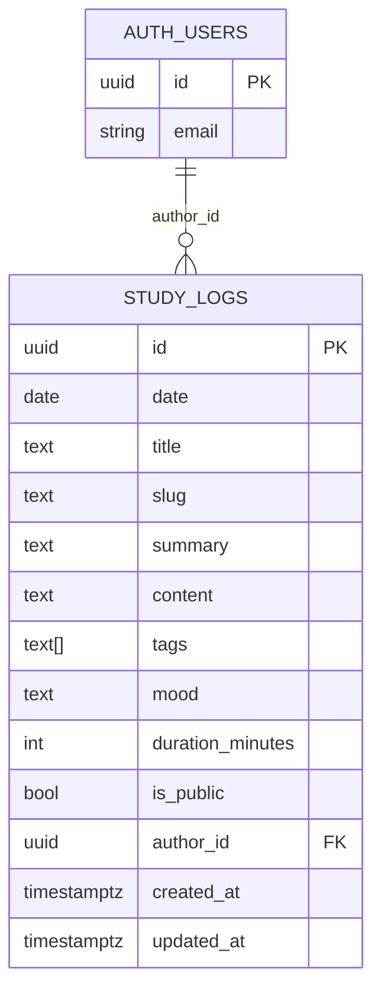
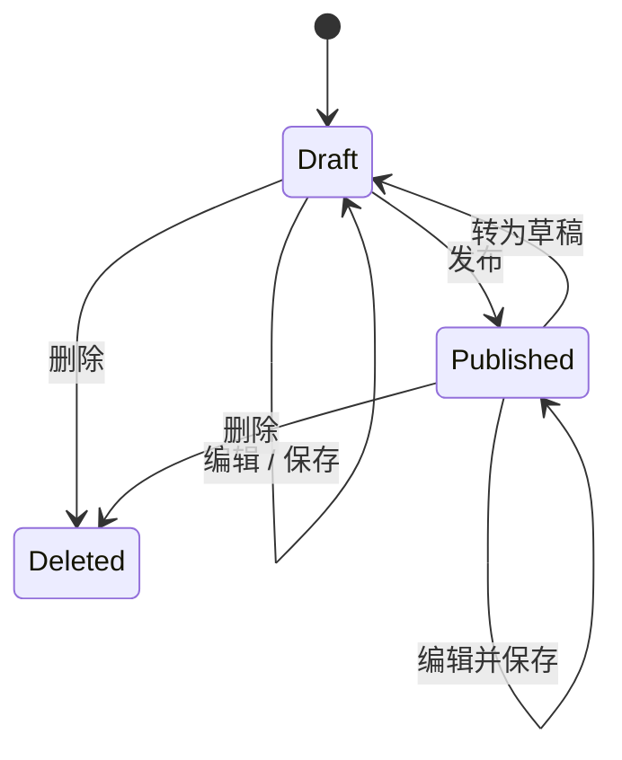
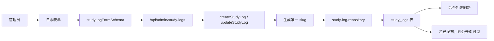

# 个人主页与学习日志系统项目介绍

> 风格说明：本文档采用“计算机专业毕业设计/课程项目说明”的组织方式，强调需求分析、系统设计、数据库设计、测试验证与总结展望。其内容严格基于当前仓库的真实实现，不引入未落地功能，也不虚构性能数据或实验结果。

| 项目项 | 内容 |
| --- | --- |
| 项目名称 | personal-homepage |
| 文档定位 | 项目介绍 / 课程汇报 / 毕业设计阶段性材料 |
| 在线地址 | [https://www.anoddy.com](https://www.anoddy.com) |
| 主体技术 | Next.js、TypeScript、Supabase、Tailwind CSS、Zod、Vercel |
| 核心模块 | 个人主页、学习日志、后台日志管理、后台标签管理 |
| 仓库地址 | [https://github.com/Anoddy-Li/personal-homepage](https://github.com/Anoddy-Li/personal-homepage) |

---

## 摘要

随着个人品牌表达、长期学习记录与轻量化内容管理需求的增长，传统静态个人主页在可维护性、持续更新能力和数据组织方式上逐渐暴露出局限。为解决“个人主页展示”与“学习日志长期沉淀”之间的割裂问题，本文围绕一个真实可上线的中文个人主页系统展开设计与实现。

本项目基于 Next.js App Router 构建公开站点与后台管理界面，使用 Supabase 提供 Postgres 数据持久化与管理员认证能力，并以 Zod 统一前后端表单校验逻辑。系统在公开侧提供首页、关于我、联系页以及学习日志公开列表与详情页；在后台侧提供学习日志的创建、编辑、删除、发布/转草稿，以及标签目录的新增、重命名、删除等能力。与“手工维护 Markdown 文件”的方案不同，本系统将学习日志及其状态真实写入数据库，以保证可持续维护与权限边界的清晰性。

从工程实现上看，项目采用内容配置入口、业务服务层、数据访问仓储层与自动化测试的组合方式，使其既能够作为正式上线的个人主页，又具备作为课程项目、结题展示或毕业设计阶段成果的完整性。当前项目已完成线上部署、自定义域名接入、管理员后台联调以及关键路径测试验证。

## 关键词

个人主页；学习日志；Next.js；Supabase；后台管理；TypeScript；Zod；中文网站设计

---

## 1. 项目背景与研究意义

### 1.1 项目背景

在个人网站建设实践中，常见方案大致分为两类：一类偏重展示，采用纯静态页面快速上线；另一类偏重内容管理，采用完整 CMS 或博客系统实现动态维护。前者搭建成本低，但后续内容更新往往需要直接修改代码或文本文件；后者功能完善，但对轻量个人项目而言又容易引入超出实际需求的复杂度。

对于“个人主页 + 长期学习记录”这一场景而言，真正需要解决的问题并非单页视觉展示，而是以下几个方面的平衡：

1. 站点应当具备正式上线能力，能够长期作为个人入口存在。
2. 学习日志应当支持持续积累、后续筛选与公开归档，而非散落于本地文件。
3. 内容维护应尽可能降低摩擦，尤其不能要求维护者频繁修改源代码才能发布日志。
4. 页面应适合中文表达，既保持简洁与克制，又具备完整的信息承载能力。

### 1.2 研究意义

本项目的意义主要体现在三个层面。

第一，针对个人主页场景，项目提供了一种轻量但真实的全栈实现路径。它不依赖复杂的内容系统，却完整具备数据库、认证、权限控制与后台管理能力。

第二，针对长期学习记录场景，项目将“学习日志”作为核心业务对象进行结构化建模，使记录、筛选、发布与归档形成闭环，有利于后续持续积累。

第三，从工程教学角度看，本项目能够作为一个中等规模的 Web 全栈案例，覆盖页面设计、接口实现、数据库建模、权限边界、测试验证与线上部署等多个环节，具备较强的复现与展示价值。

---

## 2. 需求分析

### 2.1 总体需求

项目面向的真实需求并非“搭一个主页”，而是构建一个支持长期表达与持续维护的个人站点系统。围绕这一目标，需求可分为公开展示需求、学习日志需求、后台维护需求与工程交付需求四个层面。

### 2.2 功能需求分析

| 编号 | 功能需求 | 说明 |
| --- | --- | --- |
| F1 | 首页展示 | 展示个人定位、简介与核心入口，形成站点主入口 |
| F2 | 关于我页面 | 集中呈现个人背景、技能、研究兴趣、学习经历与近期项目 |
| F3 | 联系页面 | 提供稳定的联系信息与交流入口 |
| F4 | 学习日志公开列表 | 面向访客展示已发布日志，并支持筛选与检索 |
| F5 | 学习日志详情页 | 展示日志正文、摘要、标签、日期与附加字段 |
| F6 | 管理员登录 | 仅允许指定管理员账户进入后台 |
| F7 | 日志后台管理 | 管理员可新增、编辑、删除、发布或转为草稿 |
| F8 | 标签后台管理 | 管理员可新增标签、修改标签名称、删除未被使用标签 |
| F9 | 数据持久化 | 所有日志数据需真实写入数据库 |
| F10 | 自动部署 | 保持 GitHub 到 Vercel 的自动部署链路 |

### 2.3 非功能需求分析

| 类别 | 需求内容 |
| --- | --- |
| 可维护性 | 静态内容集中管理，日志与标签通过后台维护 |
| 可用性 | 移动端与桌面端均可正常访问，关键路径不能出现死链与空按钮 |
| 安全性 | 后台操作需经过认证与管理员邮箱校验，非管理员不可进入管理能力 |
| 一致性 | 前后端校验规则一致，失败场景有明确错误反馈 |
| 可部署性 | 使用 Vercel 完成生产部署，并支持自定义域名 |
| 可扩展性 | 业务逻辑与数据访问解耦，便于后续扩展搜索、统计或内容模块 |

### 2.4 角色与权限分析

| 角色 | 访问范围 | 主要能力 |
| --- | --- | --- |
| 访客 | 首页、关于我、学习日志、联系页 | 浏览公开信息与已发布日志 |
| 管理员 | 登录页、后台管理页面、后台接口 | 维护日志、维护标签、控制公开状态 |



---

## 3. 总体设计

### 3.1 设计目标

系统总体设计遵循以下原则：

1. 前台与后台共用一套应用框架，减少技术割裂。
2. 学习日志必须以数据库为中心，而非以源码文件为中心。
3. 公开访问链路与后台管理链路严格分离。
4. 静态信息与动态业务数据采用不同维护方式。

### 3.2 系统架构设计

**图 1 系统总体架构图**



### 3.3 页面结构设计

**图 2 页面结构图**



### 3.4 前后端交互说明

系统的交互方式并不依赖单独的后端服务仓库，而是由 Next.js 内部的页面与 API 路由协同完成：

- 公开页通过服务端读取数据库中的已发布日志
- 后台页面通过接口调用完成增删改查
- 所有表单提交先经过 Zod 校验，再进入业务服务层
- 业务服务层调用仓储层，再由 Supabase 客户端与数据库交互

### 3.5 技术选型对照

| 选型项 | 采用方案 | 在系统中的作用 | 选择理由 |
| --- | --- | --- | --- |
| Web 框架 | Next.js App Router | 统一页面、服务端渲染与接口入口 | 适合构建公开页面与后台管理一体化应用 |
| 开发语言 | TypeScript | 提供类型约束与接口一致性 | 有利于复杂页面与服务层协作 |
| 样式方案 | Tailwind CSS + shadcn/ui | 快速构建界面与复用组件 | 既保持效率，也保留设计可塑性 |
| 数据库 | Supabase Postgres | 持久化学习日志与标签目录信息 | 成本低、接入快、适合中小型项目 |
| 认证方案 | Supabase Auth | 管理员登录与会话保持 | 减少自建认证系统的复杂度 |
| 校验方案 | Zod | 前后端统一表单与筛选校验 | 明确错误边界，减少 silent fail |
| 测试方案 | Vitest + Testing Library | 关键逻辑与交互验证 | 覆盖核心服务层与前端交互路径 |
| 部署方案 | Vercel | 生产部署与自动发布 | 与 GitHub 协作顺畅，适合个人项目持续交付 |

---

## 4. 数据库设计

### 4.1 数据存储策略

项目当前的核心业务表为 `study_logs`。日志标题、日期、摘要、正文、标签、心情、学习时长与公开状态等信息均保存在该表中。

需要特别说明的是：**标签目录并未额外建立独立数据表**。当前实现采用“系统保留记录”的方式在 `study_logs` 中维护标签目录，即以保留 `slug` 的隐藏记录存储全站标签列表，后台新增/改名/删除标签时会同步维护这条系统记录。这一设计避免了不必要的 schema 扩张，同时满足了当前项目规模下的目录管理需求。

### 4.2 主要数据实体关系

**图 3 数据实体关系图**



> 说明：标签目录的物理实现不对应独立数据表，而是以 `study_logs` 中的系统保留记录维护。

### 4.3 核心字段说明

| 字段名 | 类型 | 说明 |
| --- | --- | --- |
| `id` | `uuid` | 学习日志主键 |
| `date` | `date` | 日志对应日期 |
| `title` | `text` | 日志标题 |
| `slug` | `text` | 公开路由标识，唯一 |
| `summary` | `text` | 日志摘要，用于列表页与 SEO 文本承接 |
| `content` | `text` | Markdown 正文 |
| `tags` | `text[]` | 标签数组 |
| `mood` | `text` | 可选的学习状态 |
| `duration_minutes` | `integer` | 可选的学习时长 |
| `is_public` | `boolean` | 是否在公开页展示 |
| `author_id` | `uuid` | 关联 Supabase 用户 |
| `created_at` | `timestamptz` | 创建时间 |
| `updated_at` | `timestamptz` | 更新时间 |

### 4.4 日志状态设计

| 状态 | 含义 | 是否公开可见 |
| --- | --- | --- |
| 草稿 | 后台维护中，尚未对访客开放 | 否 |
| 已发布 | 出现在公开列表与详情页 | 是 |

**图 4 学习日志生命周期图**



---

## 5. 关键功能模块设计与实现

### 5.1 首页展示模块

首页负责完成站点第一层信息传达，内容包括：

- 个人身份信息条
- 主标题与简介
- 关于我与学习日志入口
- 当前主线信息卡片

其设计重点并非堆叠内容，而是通过紧凑而有留白的版式建立“中文个人主页 + 科技产品站”之间的平衡关系。

<p align="center">
  
</p>

### 5.2 关于我与联系信息模块

该模块集中承载静态内容，主要数据来自 `src/content/site.ts`，包括：

- 姓名、昵称、学校与城市
- 研究兴趣与学习方向
- 技能栈与常用工具
- 学习经历、兴趣方向与联系方式

该部分采用“集中配置文件 + 页面按需渲染”的设计方式，降低后续维护成本。

### 5.3 学习日志公开展示模块

公开学习日志页面的核心目标是提供一个可持续浏览与回看的知识归档入口。其公开侧能力包括：

- 只展示已发布日志
- 按日期、关键词、标签筛选
- 列表页与详情页联动
- Markdown 正文展示

<p align="center">
  
</p>

### 5.4 日志筛选与搜索模块

日志筛选逻辑由 URL 参数驱动，核心过滤字段包括：

- `q`：关键词
- `date`：日期
- `tag`：标签
- `visibility`：后台可用的可见性筛选

筛选过程由 `studyLogFiltersSchema` 完成解析与约束，之后由仓储层将条件转化为数据库查询。

### 5.5 管理员认证模块

管理员认证依赖 Supabase Auth 登录，同时在业务层增加邮箱白名单判断。其关键逻辑包括：

1. 登录页提交邮箱与密码
2. API 路由调用 `supabase.auth.signInWithPassword`
3. 登录成功后检查该邮箱是否存在于 `ADMIN_EMAILS`
4. 非管理员即便登录成功，也会被立即登出并拒绝访问后台

这一设计能够在较低复杂度下建立清晰的权限边界。

### 5.6 学习日志后台管理模块

后台日志管理覆盖以下操作：

- 新建日志
- 编辑日志
- 删除日志
- 切换公开/草稿
- 维护标题、日期、摘要、正文、标签、时长、心情等字段

编辑器支持 Markdown 正文输入与实时预览，并在保存前执行前后端双重校验。

**图 5 后台日志管理流程**



<p align="center">
  
</p>

### 5.7 标签后台管理模块

标签管理模块的目标是将“日志标签”从自由文本输入升级为可维护目录，其后台支持：

- 新增标签
- 修改标签名称
- 删除未被日志使用的标签
- 在日志编辑器中直接选择已有标签

当管理员修改标签名称时，系统会同步更新所有关联日志；当管理员尝试删除仍被使用的标签时，系统会拒绝该操作并给出明确提示。

<p align="center">
  
</p>

### 5.8 标签目录实现说明

当前标签目录并非来自前端常量，而是来自数据库中的系统保留记录。其意义在于：

- 公开页标签列表来自真实数据
- 后台日志编辑器可以读取已有标签目录
- 标签删除时能够检查关联关系
- 不需要引入新的独立表即可完成当前阶段需求

---

## 6. 界面设计说明

### 6.1 设计原则

项目界面设计遵循以下原则：

1. 中文信息优先，不套用英文模板结构。
2. 风格简洁、克制、现代，但避免过度装饰。
3. 公开页重视阅读体验，后台页重视可维护性与操作反馈。
4. 动效只做轻量增强，不以炫技为目标。

### 6.2 字体与排版

当前字体组合为：

- 正文：`Noto Sans SC`
- 标题：`Noto Serif SC`

这一选择主要服务于中文信息承载与正式感表达，使页面在移动端与桌面端均具有较好的稳定性。

### 6.3 页面层级控制

公开页采用较低信息密度的分区组织方式：

- 首页突出个人定位与站点主题
- 关于我页承担完整介绍功能
- 学习日志页突出筛选与归档关系
- 联系页强调明确、稳定的联系入口

后台页则以信息操作效率为核心，将状态反馈、列表管理与编辑器布局置于优先级更高的位置。

---

## 7. 管理员后台设计说明

### 7.1 后台结构

后台主要由两个业务入口组成：

- `/admin/study-logs`：日志管理
- `/admin/tags`：标签管理

后台首页用于承接管理入口，避免管理员直接暴露在某个具体编辑页面。

### 7.2 反馈机制

后台交互中所有关键操作均有明确反馈：

- 创建/更新成功：显示成功提示并刷新列表
- 删除失败：返回错误消息，不做静默兜底
- 标签冲突：直接提示标签已存在或仍被使用
- 权限不足：返回 403 或跳转到登录页

### 7.3 后台与公开站点联动

后台更新日志或标签后，变化会直接反映到数据库与公开站点上：

- 发布日志后，公开学习日志页即可读取
- 转为草稿后，公开页自动不可见
- 标签改名后，相关日志标签同步变更

---

## 8. 测试与验证

### 8.1 测试策略

本项目当前不强调大规模性能实验，而是以真实业务路径验证为主，重点覆盖：

- 日志 CRUD
- 公开/草稿边界
- 管理员权限边界
- 标签管理逻辑
- 前端筛选与关键交互
- 构建、类型与静态检查

### 8.2 自动化测试现状

截至当前仓库版本，项目已编写 7 个测试文件，共 18 条自动化测试用例，并配合以下命令完成工程验收：

```bash
pnpm lint
pnpm typecheck
pnpm test
pnpm build
```

### 8.3 代表性测试用例

| 编号 | 测试目标 | 验证内容 | 对应实现 |
| --- | --- | --- | --- |
| T01 | 创建学习日志 | 管理员可成功创建日志并生成 slug | `study-log-service.test.ts` |
| T02 | 编辑学习日志 | 修改标题后内容成功更新 | `study-log-service.test.ts` |
| T03 | 删除学习日志 | 删除后记录不可再读取 | `study-log-service.test.ts` |
| T04 | 公开/草稿边界 | 草稿默认不出现在公开查询中 | `study-log-service.test.ts` |
| T05 | 非管理员限制 | 非管理员不能执行后台写操作 | `study-log-service.test.ts`、`auth.test.ts` |
| T06 | 创建标签 | 管理员可新增标签目录项 | `study-log-tag-service.test.ts` |
| T07 | 重命名标签 | 标签改名后关联日志同步更新 | `study-log-tag-service.test.ts` |
| T08 | 删除已使用标签 | 被日志引用的标签不能直接删除 | `study-log-tag-service.test.ts` |
| T09 | 标签筛选显示 | 激活标签后文本保持可见且链接正确 | `tag-filter-link.test.tsx` |
| T10 | 顶部栏交互 | 顶部范围显示与回到顶部按钮状态联动 | `site-header.test.tsx` |

### 8.4 人工验收内容

在自动化测试之外，项目还需通过人工检查以下关键路径：

- 首页、学习日志页、联系页的正常展示
- 管理员登录与后台访问
- 日志发布后公开可见
- 自定义域名与 HTTPS 可用
- GitHub 推送后 Vercel 自动部署正常

### 8.5 验收结论

从当前实现状态看，项目已经具备以下可交付特征：

- 页面结构完整
- 数据流转真实
- 权限边界清晰
- 管理后台可用
- 自动部署链路已跑通
- 关键业务路径已有自动化测试支撑

---

## 9. 项目总结与展望

本文档介绍的个人主页与学习日志系统，并非以复杂业务规模为目标，而是围绕“长期记录、真实维护、正式上线”三个关键词展开。通过 Next.js、Supabase、TypeScript 与 Zod 的组合，项目在不引入过重基础设施的前提下，实现了公开站点、后台管理、真实数据库写入、权限控制与自动部署的完整闭环。

从项目实现效果来看，其主要价值不在于“功能数量多”，而在于每个功能都围绕真实需求完成了闭环设计：公开展示并非空壳页面，学习日志并非伪后端内容，后台管理并非不可用的演示界面，标签目录也并非前端写死常量。这使项目同时具备展示性、实用性与教学参考价值。

当然，当前系统仍存在进一步扩展的空间。例如：

- 引入更细粒度的全文检索能力
- 增加学习日志年度归档与统计看板
- 丰富研究记录、阅读笔记等内容类型
- 为后台补充更强的操作审计与批量管理能力

总体而言，本项目已经形成一个结构完整、边界清晰、可持续维护的个人全栈站点雏形，适合作为课程项目、结题材料与毕业设计阶段性成果的展示基础。

---

## 10. 附录

### 10.1 相关文档

- 仓库主页文档：[../README.md](../README.md)
- 内容维护指南：[../CONTENT_GUIDE.md](../CONTENT_GUIDE.md)

### 10.2 PDF 导出建议

如果需要将本文档用于课程汇报、答辩材料或阶段性归档，可采用以下方式导出 PDF：

1. 在 GitHub 或本地 Markdown 预览中打开本文档
2. 使用浏览器“打印”
3. 选择“另存为 PDF”
4. 保留背景图形与页眉页脚关闭选项，即可获得较为干净的导出版式
